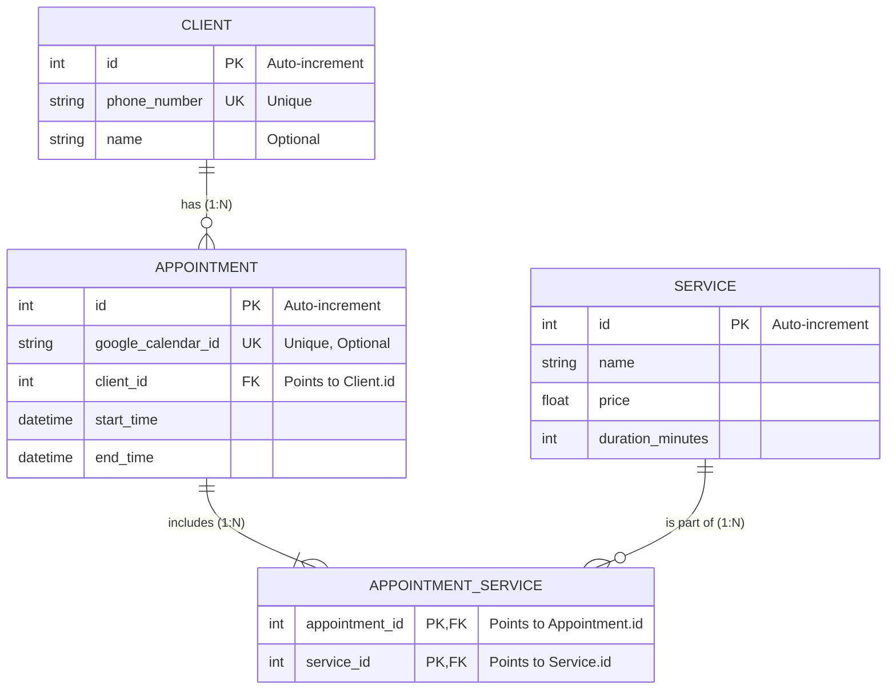

# ASSISTANTFY

> **An AI-powered SaaS backend designed to automate business workflows and booking management.**

Assistantfy eliminates the need for manual call handling by leveraging Natural Language Processing (NLP) to answer FAQs, manage end-to-end appointment scheduling, and significantly increase operational efficiency for local service businesses.


## 🎯 Project Objectives & Roadmap
The goal of this project is to build a highly scalable, asynchronous backend with a clean architecture:
- [x] **Real-time Comms:** Receive and send messages in real-time via WhatsApp Cloud API Webhooks.
- [x] **AI Integration:** Process natural language using DeepSeek's LLM to accurately understand and route user intent.
- [ ] **Database Management:** Manage a relational database to schedule, modify, or cancel appointments automatically.
- [ ] **External Sync:** Calendar synchronization (e.g., Google Calendar API).

📖 **Track my daily progress, technical decisions, and blockers here:** [PROGRESSLOG.md](./PROGRESSLOG.md)

---

## 🏗️ Database Architecture (E/R Diagram)
Designed focusing on data integrity and normalization to provide the AI agent with a robust and efficient source of truth.



**1. Clone the repository** 
 ```bash
   git clone [https://github.com/javiperezdev/assistantfy.git](https://github.com/javiperezdev/assistantfy.git)  
   cd assistantfy 
```

**2. Create a virtual environment and install dependencies**

```bash
python -m venv venv  source venv/bin/activate  # On Windows use `venv\Scripts\activate`  
pip install -r requirements.txt   
```

**3. Environment Variables**
Create a .env file in the root directory:

```shell 
WHATSAPP_TOKEN=your_meta_system_user_token  
VERIFY_TOKEN=your_custom_verify_token  
PHONE_NUMBER_ID=your_meta_phone_number_id   
```

**4. Run the development server**

```bash 
uvicorn app.main:app --reload  
```

(Note: To test webhooks locally, you will need a tool like [Ngrok](https://ngrok.com/) to expose your localhost to the internet).

Developed with curiosity by **javiperezdev**